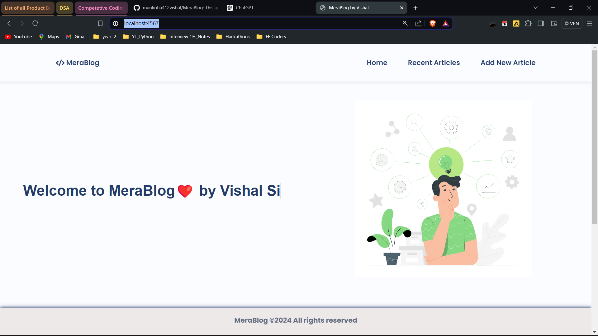
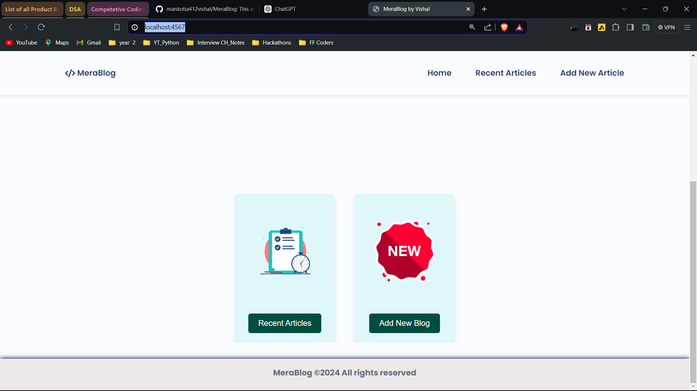
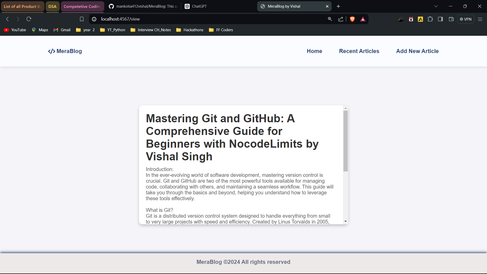
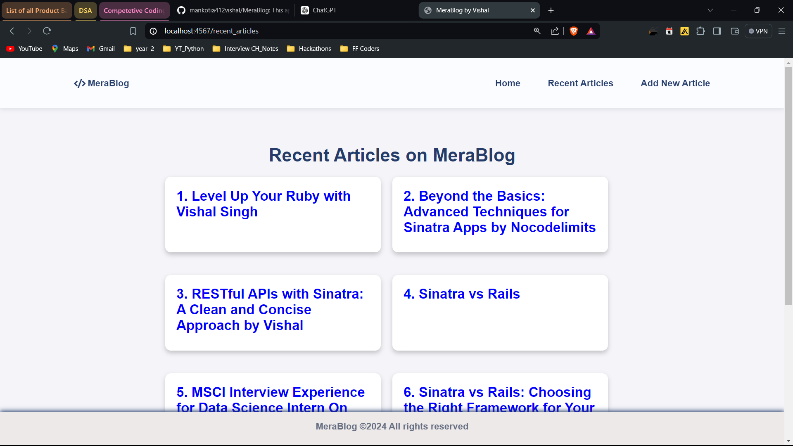
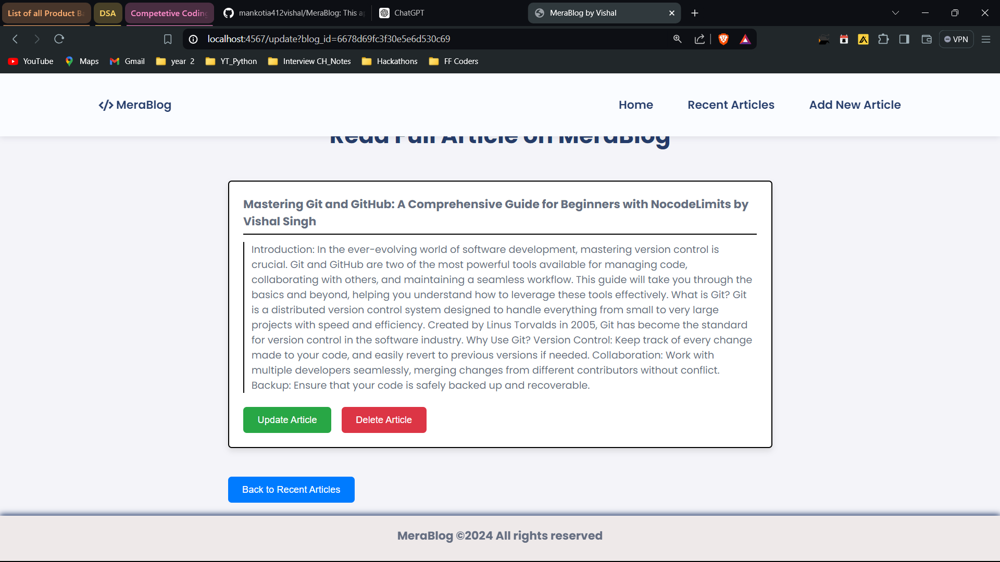

## MeraBlog
This app is created for learning purposes just to explore Sinatra framework of Ruby

## Objectives
<pre>
1. Create a blog app using Sinatra
2. To learn to use Sinatra framework
3. How to connect to a database using ActiveRecord
4. How to use ActiveRecord to perform CRUD operations
5. How to use Sinatra to render views
6. How to use Sinatra to handle routes
7. How to use Sinatra to handle requests
</pre>

## Features
<pre>
1. User can create a new post
2. User can view all posts
3. User can view a single post
4. User can update a post
5. User can delete a post
</pre>

## Technologies
<pre>
1. Ruby
2. Sinatra
3. MongoDB
4 Javascript
5. HTML
6. CSS
</pre>

## How to run the app
<pre>
1. Clone the repository
2. Run `bundle install` to install dependencies
3. Run `ruby app.rb` to start the server
4. Visit `http://localhost:4567` in your browser
</pre>

## Some screenshots of the app

